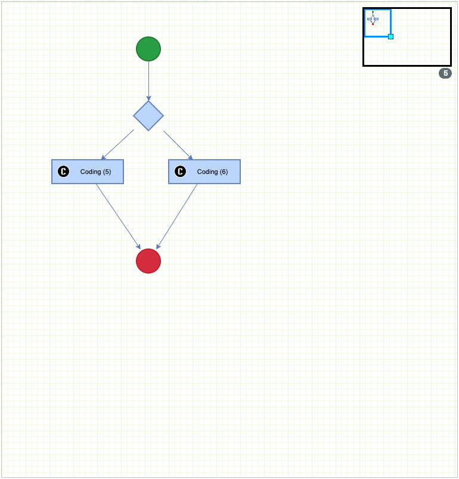
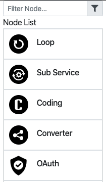
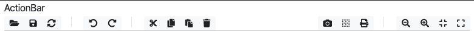
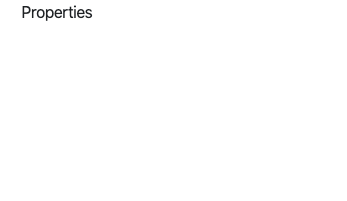
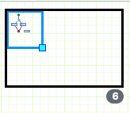

[TOC]

# Installation


```json
npm i ssq-flow-D
```

```json
npm i mxgraph -D
```

```react
// webpack.config.js
module.exports = {
  module: {
    rules: [
      ...,
      {
        test: require.resolve("mxgraph/javascript/mxClient"),
        use:
          "exports-loader?" +     "mxClient,mxEditor,mxLog,mxObjectIdentity,mxDictionary,mxResources,mxEffects,mxUtils,mxConstants,mxEvent,mxClipboard,mxUrlConverter,mxVmlCanvas2D,mxStencilRegistry," +        "mxMarker,mxHierarchicalEdgeStyle,mxCell,mxCellPath,mxPerimeter,mxEdgeStyle,mxStyleRegistry,mxCodecRegistry,mxGenericChangeCodec,mxStylesheetCodec,mxDefaultToolbarCodec," +         "mxGraph,mxRubberband,mxHierarchicalLayout,mxFastOrganicLayout,mxGraphModel,mxPanningHandler,mxKeyHandler,mxParallelEdgeLayout,mxLayoutManager,mxCompactTreeLayout," +         "mxPrintPreview,mxToolbar,mxOutline,mxCellTracker,mxCellOverlay,mxImage,mxLoadResources,mxPopupMenu,mxCylinder,mxRectangle,mxCellRenderer,mxVertexHandler,mxPoint," +
"mxHandle,mxRhombus,mxActor,mxArrow,mxArrowConnector,mxCloud,mxConnector,mxConnector,mxEllipse,mxHexagon,mxImageShape,mxLabel,mxLine,mxPolyline,mxMarker,mxRectangleShape," +       "mxShape,mxStencil,mxStencilRegistry,mxSwimlane,mxText,mxTriangle,mxAutoSaveManager,mxDivResizer,mxForm,mxGuide,mxImageBundle,mxImageExport,mxLog,mxMorphing,mxMouseEvent," +         "mxPanningManager,mxSvgCanvas2D,mxUndoableEdit,mxUndoManager,mxUrlConverter,mxWindow,mxXmlCanvas2D,mxXmlRequest,mxCellEditor,mxCellState,mxCellStatePreview,mxConnectionConstraint," +         "mxGraphSelectionModel,mxGraphView,mxMultiplicity,mxSwimlaneManager,mxTemporaryCellStates,mxGeometry,mxStackLayout,mxRadialTreeLayout,mxPartitionLayout,mxGraphLayout," +         "mxEdgeLabelLayout,mxCompositeLayout,mxCircleLayout,mxSwimlaneOrdering,mxMinimumCycleRemover,mxMedianHybridCrossingReduction,mxHierarchicalLayoutStage,mxCoordinateAssignment," +         "mxSwimlaneLayout,mxObjectCodec,mxGenericChangeCodec,mxTooltipHandler,mxSelectionCellsHandler,mxPopupMenuHandler,mxGraphHandler,mxElbowEdgeHandler,mxEdgeHandler," +         "mxConstraintHandler,mxConnectionHandler,mxCellMarker,mxCellHighlight,mxDefaultPopupMenu,mxDefaultKeyHandler,mxCodec,mxGraphHierarchyModel,mxGraphAbstractHierarchyCell," +
"mxGraphHierarchyEdge,mxGraphHierarchyNode,mxSwimlaneModel,mxEdgeSegmentHandler"
      },
    ...
    ]
  }
}
```


---

# Flow Component

## FlowController

เป็น function controler สำหรับจัดการการทำงานของ Flow ประกอบไปด้วย

### Method

| Name                                | Return | Type   | Desc                                                        |
| ----------------------------------- | ------ | ------ | ----------------------------------------------------------- |
| renderFlowWithXmlStr(graph, xmlStr) | -      |        | เป็น function อ่าน  xml ออกมาเป็น Flow                         |
| initialGraphProperties(editor)      | -      |        | เป็น function สำหรับกำหนด properties พื้นฐานของ Flow            |
| convertValueToString(graph)         | value  | String | เป็น function สำหรับแสดงข้อความบน  node                        |
| setNodeCounter(graph)               | -      |        | เป็น function สำหรับแสดงค่าของจำนวน node บน Flow (ไม่นับเส้นเชื่อม) |
| initialGraphEvent(editor)           | -      |        | เป็น function สำหรับกำหนด event พื้นฐานของ Flow                 |
| printFlow(editor)                   | -      |        | เป็น function preview และ print Flow                         |

---

## Flow



### Properties

| Name   | Default | Type   | Desc                              |
| ------ | ------- | ------ | --------------------------------- |
| id     | random  | String | Id สำหรับอ้างอิง component           |
| editor | null    | Object | เป็นตัวแปรสำหรับจัดการ state ของ Flow |
| graph  | null    | Object | เป็นตัวแปรสำหรับจัดการค่าของ Flow      |
| height | 500     | Number | ความสูงของ Flow                    |

### Method

| Name           | Return | Type | Desc                          |
| -------------- | ------ | ---- | ----------------------------- |
| loadGraph(ref) | -      |      | เป็น function สำหรับ load allow |

### Example

```react
import {
  Flow
} from "ssq-flow";

<Flow height={800} ref={this.flowRef} id={id} />
```


```react
import React, { Component } from "react";

import _ from "lodash";
import {
  mxClient,
  mxUtils,
  mxEditor,
  mxParallelEdgeLayout,
  mxLayoutManager,
  mxGraph,
  mxKeyHandler,
  mxDefaultKeyHandler
} from "mxgraph/javascript/mxClient";

import { createPopupMenu } from "./popupController";

import {
  Flow,
  Node,
  ActionBar,
  Properties,
  Outline,
  FlowController
} from "ssq-flow";

import KeyHandler from "./resources/keyHandler.txt";

const listNode = [
  {
    nodeId: "start",
    nodeType: "start",
    icon: "https://dl.dropboxusercontent.com/s/rxsb183p5x163ya/start.svg",
    nodeName: "Start",
    style:
      "shape=ellipse;strokeWidth=2;fillColor=#28A745;strokeColor=#218838;noLabel=1",
    height: 40,
    width: 40,
    multiplicities: {
      source: true,
      attr: null,
      value: null,
      min: 0,
      max: 1,
      validNeighbors: {
        allow: ["ALL"],
        block: ["end", "loop"]
      },
      countError: "Only 1 targets allowed",
      typeError: "Can not connect from other nodes.",
      validNeighborsAllowed: ""
    }
  },
  {
    nodeId: "end",
    nodeType: "end",
    icon: "https://dl.dropboxusercontent.com/s/eiywz47egx0u8zx/end.svg",
    nodeName: "End",
    style:
      "shape=ellipse;strokeWidth=2;fillColor=#DB3545;strokeColor=#C82332;noLabel=1",
    height: 40,
    width: 40,
    multiplicities: {
      source: true,
      attr: null,
      value: null,
      min: 1,
      max: 0,
      validNeighbors: {
        allow: ["ALL"],
        block: ["start", "end", "loop", "decision"]
      },
      countError: "Can not connect to other nodes.",
      typeError: "Can not connect to Start node",
      validNeighborsAllowed: ""
    }
  },
  ...
];

export default class flow extends Component {
  constructor(props) {
    super(props);
    this.state = { graph: null, editor: null };

    this.flowRef = React.createRef();
  }

  loadGraph = ref => {
    const container = document.getElementById(`${ref.props.id}Flow`);

    let graph = "";
    let editor = "";
    // Checks if the browser is supported
    if (!mxClient.isBrowserSupported()) {
      // Displays an error message if the browser is not supported.
      mxUtils.error("Browser is not supported!", 200, false);
    } else {
      if (mxClient.IS_QUIRKS) {
        document.body.style.overflow = "hidden";
        new mxDivResizer(container);
      }

      window.mxEditor = mxEditor;
      window.mxGraph = mxGraph;
      window.mxDefaultKeyHandler = mxDefaultKeyHandler;
      window.mxKeyHandler = mxKeyHandler;

      const doc = mxUtils.parseXml(KeyHandler);
      const config = doc.getElementsByTagName("mxEditor")[0];

      editor = new mxEditor(config);
      graph = editor.graph;

      FlowController.initialGraphProperties(editor);
      FlowController.initialGraphEvent(editor);

      // Sets the graph container and configures the editor
      editor.setGraphContainer(container);

      // Automatically handle parallel edges
      const layout = new mxParallelEdgeLayout(graph);
      const layoutMgr = new mxLayoutManager(graph);

      layoutMgr.getLayout = function(cell) {
        if (cell.getChildCount() > 0) {
          return layout;
        }
      };

      FlowController.convertValueToString(graph);

      graph.popupMenuHandler.factoryMethod = (menu, cell, evt) => {
        return createPopupMenu(editor, menu, cell, evt);
      };

      this.setState({
        graph,
        editor
      });
    }
  };

  componentDidMount() {
    this.loadGraph(this.flowRef.current);
  }

  render() {
    const { editor } = this.state;
    const id = "flow";

    return (
      <div className="container-fluid">
        <div className="row">
          <div className="col-md-2 col-sm-3">
            {!_.isEmpty(editor) && (
              <Node data={listNode} editor={editor} id={id} />
            )}
          </div>
          <div className="col-md-7 col-sm-5">
            <div className="row">
              {!_.isEmpty(editor) && (
                <ActionBar flow={this.flowRef.current} editor={editor} />
              )}
            </div>
            <div className="row">
              {!_.isEmpty(editor) && <Outline id={id} editor={editor} />}
              <Flow height={800} ref={this.flowRef} id={id} />
            </div>
          </div>
          <div className="col-md-3 col-sm-4">
            <Properties />
          </div>
        </div>
      </div>
    );
  }
}
```


---

## Node



### Properties

| Name   | Default | Type   | Desc                              |
| ------ | ------- | ------ | --------------------------------- |
| id     | random  | String | Id สำหรับอ้างอิง component           |
| editor | null    | Object | เป็นตัวแปรสำหรับจัดการ state ของ Flow |
| data   | [ ]     | Array  | Json Data สำหรับการแสดง node       |

### Example

```react
import {
  Node
} from "ssq-flow";

const listNode = [
  {
    nodeId: "start",
    nodeType: "start",
    icon: "https://dl.dropboxusercontent.com/s/rxsb183p5x163ya/start.svg",
    nodeName: "Start",
    style:
      "shape=ellipse;strokeWidth=2;fillColor=#28A745;strokeColor=#218838;noLabel=1",
    height: 40,
    width: 40,
    multiplicities: {
      source: true,
      attr: null,
      value: null,
      min: 0,
      max: 1,
      validNeighbors: {
        allow: ["ALL"],
        block: ["end", "loop"]
      },
      countError: "Only 1 targets allowed",
      typeError: "Can not connect from other nodes.",
      validNeighborsAllowed: ""
    }
  },
  {
    nodeId: "end",
    nodeType: "end",
    icon: "https://dl.dropboxusercontent.com/s/eiywz47egx0u8zx/end.svg",
    nodeName: "End",
    style:
      "shape=ellipse;strokeWidth=2;fillColor=#DB3545;strokeColor=#C82332;noLabel=1",
    height: 40,
    width: 40,
    multiplicities: {
      source: true,
      attr: null,
      value: null,
      min: 1,
      max: 0,
      validNeighbors: {
        allow: ["ALL"],
        block: ["start", "end", "loop", "decision"]
      },
      countError: "Can not connect to other nodes.",
      typeError: "Can not connect to Start node",
      validNeighborsAllowed: ""
    }
  },
  ...
];

<Node data={listNode} editor={editor} id={id} />
```


---

## ActionBar



### Properties

| Name   | Default | Type   | Desc                              |
| ------ | ------- | ------ | --------------------------------- |
| flow   | Null    | Ref    | Ref สำหรับอ้างอิง component ของ Flow |
| editor | null    | Object | เป็นตัวแปรสำหรับจัดการ state ของ Flow |

### Example

```react
import {
  ActionBar
} from "ssq-flow";
  
this.flowRef = React.createRef();

<Flow height={800} ref={this.flowRef} id={id} />
<ActionBar height={800} flow={this.flowRef.current} />
```


---

## Properties



### Properties

| Name | Default | Type | Desc |
| ---- | ------- | ---- | ---- |
|      |         |      |      |

###  Example

```react
import {
  Properties
} from "ssq-flow";

<Properties />
```


---

## Outline



### Properties

| Name   | Default | Type   | Desc                              |
| ------ | ------- | ------ | --------------------------------- |
| id     | random  | String | Id สำหรับอ้างอิง component           |
| editor | null    | Object | เป็นตัวแปรสำหรับจัดการ state ของ Flow |

### Example

```react
import {
  Outline
} from "ssq-flow";

 <Outline id={id} editor={editor} />
```


---


